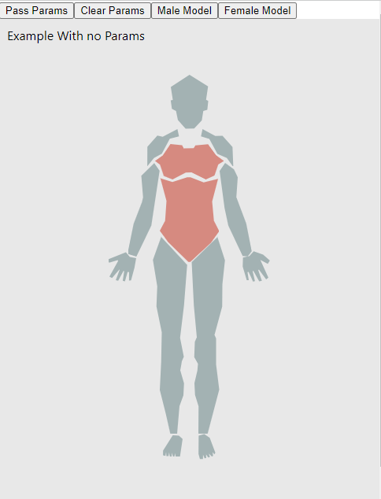

# reactjs-human-body

Build one Human Body figure inyour web Page using React.
Show the parts you want and click on them to select it.



See the [Live demo](https://stackblitz.com/edit/reactjs-human-body-example).


## How to use it

```tsx

import { BodyComponent } from 'reactjs-human-body';

const exampleParams = {
  head: { selected: true },
  left_arm: { show: false }
}

export function App() {
  const [params, setParams] = useState<any>();
  const [bodyModel, setBodyModel] = useState<string>();
  const onChange = (parts: PartsInput) => console.log('Changed Parts:', parts);
  const onClick = (id: string) => console.log('Changed Id:', id);
  
  return (
    <div>
        <button onClick={() => setParams(exampleParams)}>Pass Params</button>
        <button onClick={() => setParams(null)}>Clear Params</button>
        <button onClick={() => setBodyModel('male')}>Male Model</button>
        <button onClick={() => setBodyModel('female')}>Female Model</button>
        <BodyComponent partsInput={params} 
          bodyModel={bodyModel}
          onChange={onChange}
          onClick={onClick}
        />
  </div>
  )
}
```

## TODO

* Individual Protection Equipment (helmet...)

## Contribute:

To contribute check the [Contribute](./CONTRIBUTE.md).
